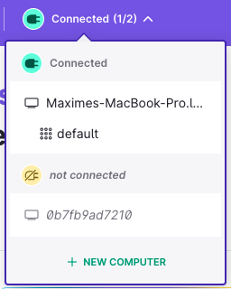
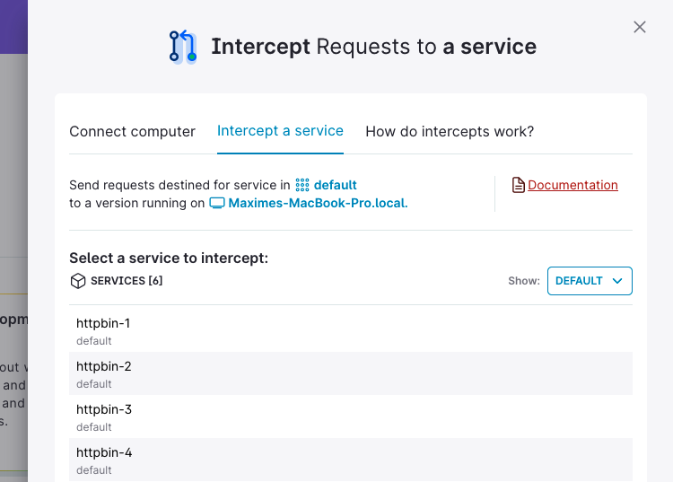
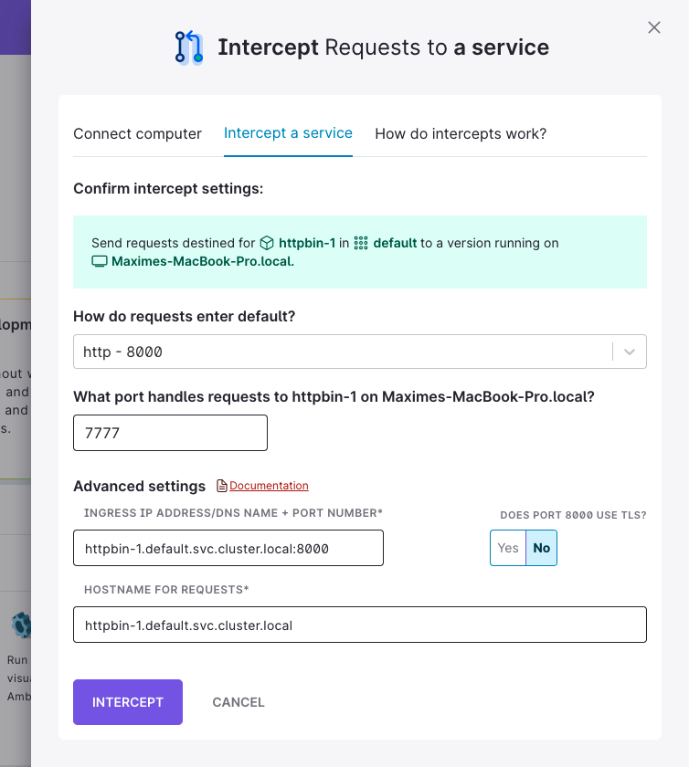

import Alert from '@material-ui/lab/Alert';

# Intercept a service

In Ambassador Cloud, it's easy to [intercept](/docs/telepresence/latest/concepts/intercepts/) a service. Once you've intercepted your service, you can code and debug the intercepted service locally.

Intercepts are created through the Telepresence Daemon. If you don't have Telepresence v2.5.0 or later already installed, follow [these instructions](/docs/telepresence/latest/install/) to install the latest version of Telepresence.

## Intercept from Ambassador Cloud's main header

1. Open [Ambassador Cloud](https://app.getambassador.io/) and log in.
1. The Ambassador Cloud header displays your connection status. If it reads **not connected**, click the connection dropdown and click **connect computer**.
   A slideout displays with instructions on how to connect to Ambassador Cloud.
1. Once you are connected, click the the **connected** dropdown, select your connected computer, and click the "Intercept" button.
   
1. In the intercept slideout, you can see the list of services available to intercept for that namespace, and a dropdown to change namespaces.
   
1. Click the service you want to intercept.
1. [Fill out the form to complete the intercept.](#fill-out-the-form-to-complete-the-intercept)

## Intercept from the main Service Catalog view

1. Open [Ambassador Cloud](https://app.getambassador.io/) and log in.
1. The Ambassador Cloud header displays your connection status. If it reads **not connected**, click the connection dropdown and click **connect computer**.
   A slideout displays with instructions on how to connect to Ambassador Cloud.
   Ambassador cloud opens to the Service Catalog view by default once logged in and connected.
1. Find the service you want to intercept and click on it to go to the Service Details view.
1. Select a cell and click the intercept button.
1. [Fill out the form to complete the intercept.](#fill-out-the-form-to-complete-the-intercept)

   

## Intercept from the Service Details view

1. Open [Ambassador Cloud](https://app.getambassador.io/) and log in.
1. The Ambassador Cloud header displays your connection status. If it reads **not connected**, click the connection dropdown and click **connect computer**.
   A slideout displays with instructions on how to connect to Ambassador Cloud.
1. Click the `Intercept` tab.
1. Click the `New Intercept` button.
1. [Fill out the form to complete the intercept.](#fill-out-the-form-to-complete-the-intercept)

## Fill out the form to complete the intercept

1. Select the port from your service that you want to intercept.
1. Select the port on your computer where requests will be sent.
1. Optionally, update the advanced settings to define how requests from generated preview url should be sent to you cluster:
   1. In the "INGRESS IP ADDRESS/DNS NAME + PORT NUMBER" field, enter the address and port of a LoadBalancer service in your cluster.
   1. Select whether or not the LoadBalancer service port uses TLS.
   1. Specify the `Host` header that should be passed along with the request. If you have a Mapping that routes requests to your services based a specific hostname, that is the value you should specify here.
1. Click `Intercept`.

   
