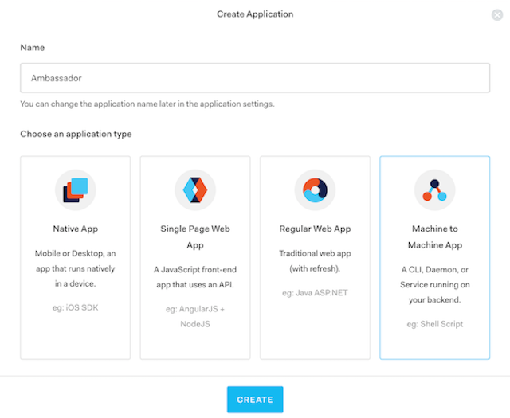
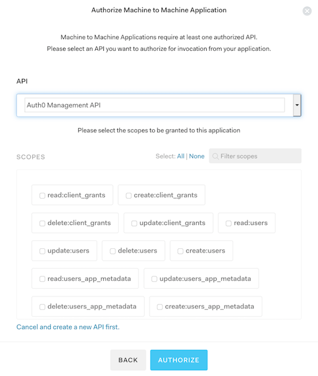
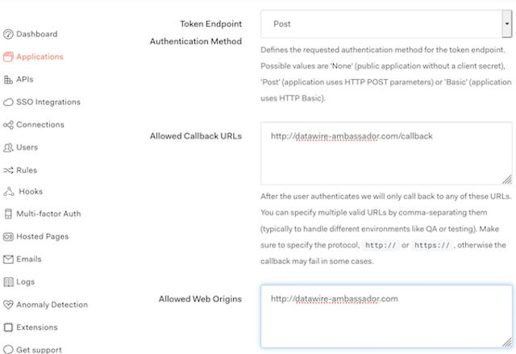

import Alert from '@material-ui/lab/Alert';

# Single Sign-On with Auth0

With Auth0 as your IdP, you must create an `Application` to handle authentication requests from $productName$.

## Create an Application in Auth0

1. Navigate to Applications and Select `CREATE APPLICATION`

   

2. In the pop-up window, give the application a name and create a `Machine to Machine App`

   

3. Select the Auth0 Management API.

   - Grant any scope values you may require (you may grant none).
   - The API is required so that an `audience` can be specified, which will result in a JWT being returned rather than opaque token. A custom API can also be used.

   

4. In your newly created application, click on the `Settings` tab

   - Add the Domain and Callback URLs for your service
   - Ensure the `Token Endpoint Authentication Method` is set to `Post`. The default YAML installation of $productName$ uses `/.ambassador/oauth2/redirection-endpoint` for the URL, so the values should be the domain name that points to $productName$, e.g., `example.com/.ambassador/oauth2/redirection-endpoint` and `example.com`.

   

5. Click `Advanced Settings` > `Grant Types` and check `Authorization Code`

## Configure an OAuth2 Filter and FilterPolicy

1. Create an [OAuth2 Filter][] with the credentials from above:

   ```yaml
   kubectl apply -f -<<EOF
   ---
   apiVersion: gateway.getambassador.io/v1alpha1
   kind: Filter
   metadata:
     name: auth0-oauth2-filter
     namespace: default
   spec:
     type: "oauth2"
     oauth2:
       authorizationURL: https://datawire-ambassador.auth0.com
       grantType: "AuthorizationCode"
       authorizationCodeSettings:
         clientID: {{CLIENT_ID}}  # Client ID from above
         clientSecret: {{CLIENT_SECRET}} # Client secret from above
         protectedOrigins:
         # The origin is the scheme and Host of your $productName$ endpoint
         - origin: http(s)://{{AMBASSADOR_URL}}
           includeSubdomains: true
         clientAuthentication:
           jwtAssertion:
             audience: https://datawire-ambassador.auth0.com/api/v2/
   EOF
   ```

2. Create a [FilterPolicy resource][] to use the `Filter` created above

   ```yaml
   kubectl apply -f -<<EOF
   ---
   apiVersion: gateway.getambassador.io/v1alpha1
   kind: FilterPolicy
   metadata:
     name: auth0-oauth2-filterpolicy
     namespace: default
   spec:
     rules:
     - host: "*"
       path: "*"
       filterRefs:
       - name: auth0-oauth2-filter # Filter name from above
         namespace: default # Filter namespace from above
         arguments:
           type: oauth2
           oauth2:
             sameSite: lax
             scope:
             - openid
   EOF
   ```

<Alert severity="info">
  By default, Auth0 requires the <code>openid</code> scope.
</Alert>

<Alert severity="success">
  <b>Success!</b> Your Services are now protected by Auth0 single sign-on using OAuth2 Filters!
</Alert>

[OAuth2 Filter]: ../../../custom-resources/filter-oauth2
[FilterPolicy resource]: ../../../custom-resources/filterpolicy
